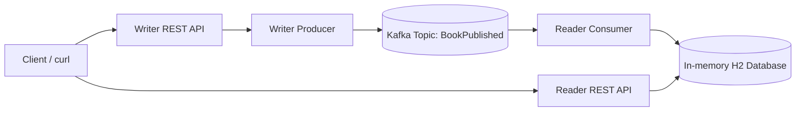

# Book Kafka Demo

Small Java/Spring Boot project with one Kafka topic, one writer producer, one reader consumer, and an in-memory H2 database.

## Components

- Topic: `BookPublished`
- Producer: `WriterService`, exposed by `POST /api/v1/writer/books`
- Consumer: `ReaderService`, listens to `BookPublished`
- Database: H2 in-memory database table `books`
- Read endpoint: `GET /api/v1/reader/books`

## High-Level Diagram



## Run

Start Kafka from the repository root:

```bash
docker compose up -d kafka kafka-ui
```

Run the app:

```bash
cd book-kafka-demo
./mvnw spring-boot:run
```

Publish a book:

```bash
curl -X POST http://localhost:8095/api/v1/writer/books \
  -H 'Content-Type: application/json' \
  -d '{"isbn":"978-0134685991","title":"Effective Java","author":"Joshua Bloch","price":45.99}'
```

Read books saved by the consumer:

```bash
curl http://localhost:8095/api/v1/reader/books
```

H2 console:

```text
http://localhost:8095/h2-console
JDBC URL: jdbc:h2:mem:booksdb
User: sa
Password:
```
